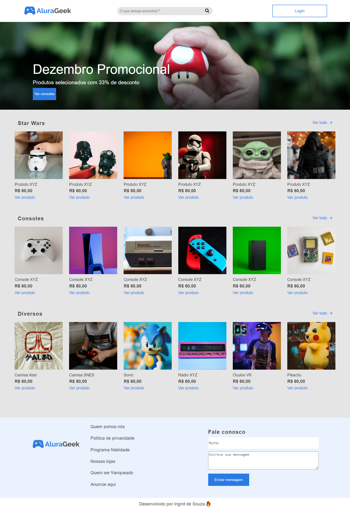
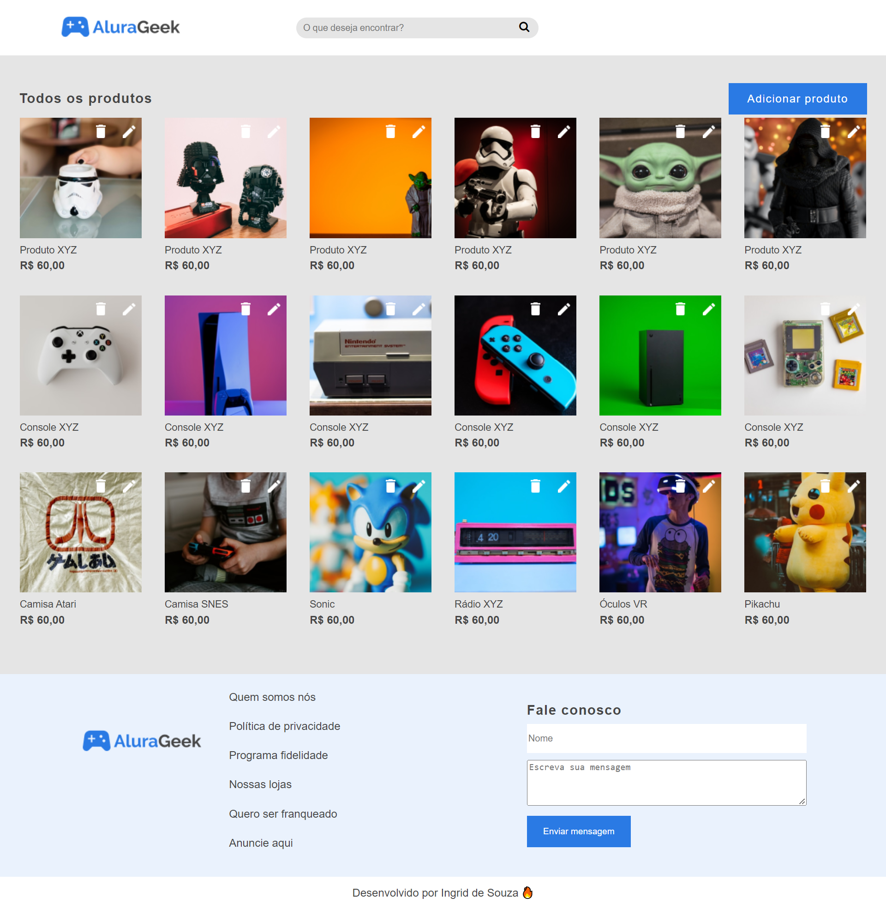
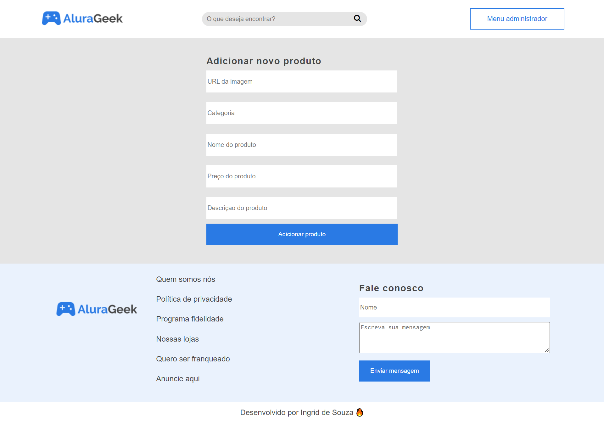
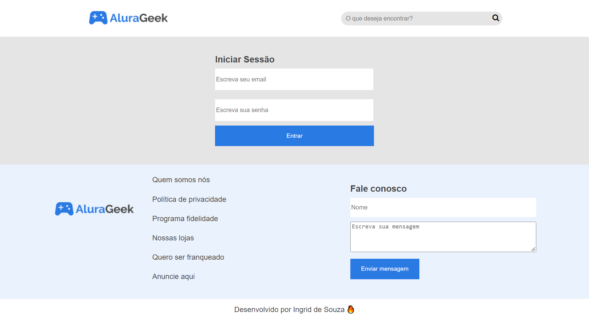

# Alura Geek E-commerce

Este é o segundo sprint do treinamento em frontEnd da Alura, com parceria com a Dio.

Neste sprint foi proposto que fizéssemos um site e-commerce, com alguns produtos, login, informações e uma forma de entrar em contato.

Feito totalmente com HTML/CSS e estou adicionando o Javascript.

## Table of contents

- [Screenshot](#screenshot)
- [Links](#links)
- [Author](#author)

### Screenshot

# Página inicial

# Produtos

# Adicionar produtos

# Login

### Links

- Solution URL: [Solution here](https://ingridssilveira.github.io/AluraGeek/)

## Author

- Website - [Ingrid Souza](https://ingridssilveira.github.io/IngridSouza)
- GitHub - [@IngridsSilveira](https://github.com/IngridsSilveira)
